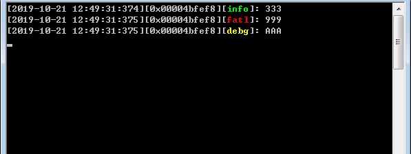
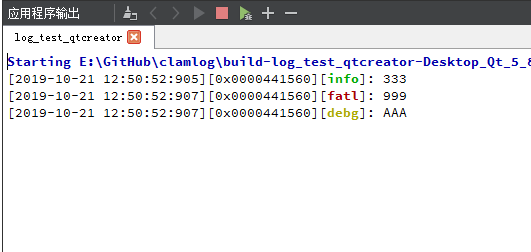
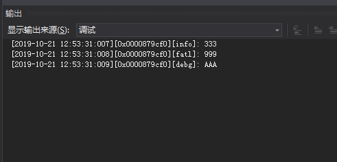

<p align="center"></p>

<div align="center"><a href="https://github.com/umatobu/clamlog/blob/master/README.md">English</a> | 简体中文</div>

<h2 align="center">clamlog - 一个基于Qt5的彩色日志库</h2>


# 效果





# 使用方法

## qt creator

xxx.pro 添加以下代码:

```
win32 {
    contains(CONFIG, console) {
        DEFINES += ULOG_COLOR_CONSOLE_STYLE
    } else {
        DEFINES += ULOG_COLOR_UNIX_STYLE
    }
} else {
    DEFINES += ULOG_COLOR_UNIX_STYLE
}
```

## VS

入股是控制台输出，添加宏:

```
ULOG_COLOR_CONSOLE_STYLE
```

如果不是控制台输出，而是VS的输出窗口输出，则添加宏:

```
ULOG_COLOR_MSVC_STYLE
```

# 扩展

重载 <<:

```
void operator << (doubel message)
{
    log(QString::number(nummber));
}
```

```
struct Human {
    Human(const QString &name_in, const int &age_in)
        : name(name_in)
        , age(age_in)
    {}
    QString name;
    int     age;
};

void operator << (Human h)
{
    log(QStringLiteral("Human(%1, '%2')").arg(h.name).arg(h.age););
}
```


